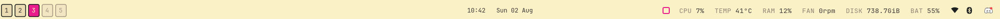
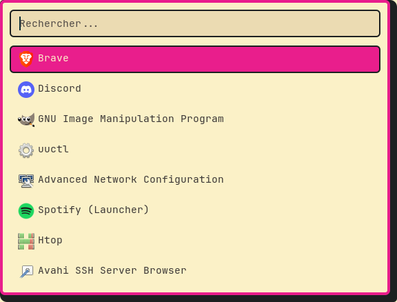
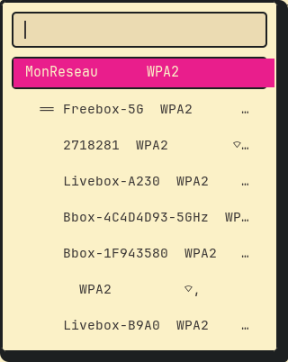
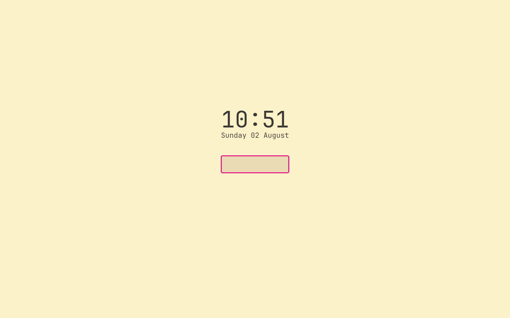
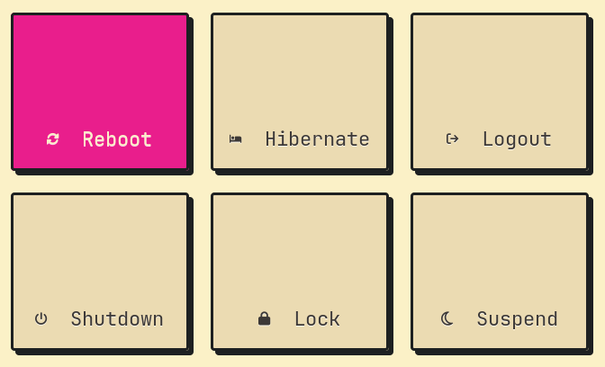
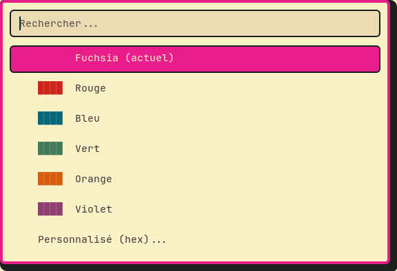
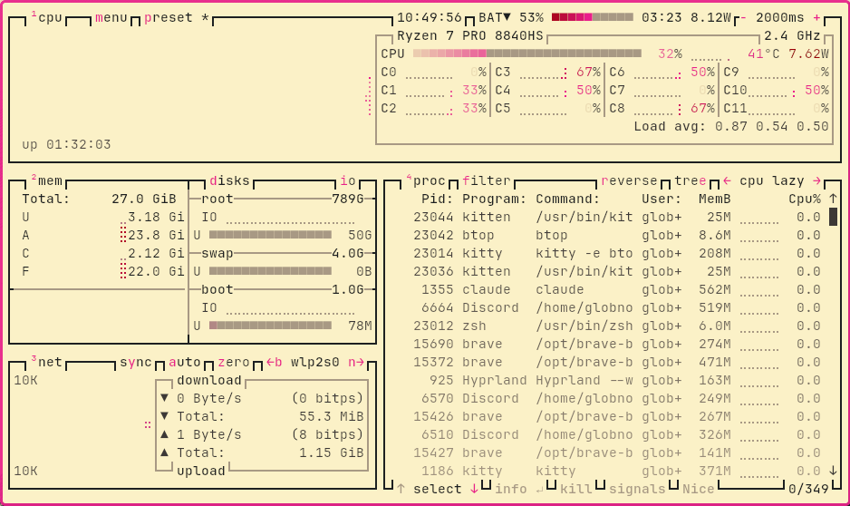

# Dotfiles

**Hyprland, style neobrutalism — Gruvbox Light + accent, sur Arch Linux.**
Daily driven sur un ThinkPad P14s Gen 5 AMD.

[Gallery](#gallery) ·
[Contenu](#contenu) ·
[Installation](#installation) ·
[Highlights](#highlights) ·
[Raccourcis](#raccourcis) ·
[Crédits](#crédits)

## Description

Bordures épaisses en faux noir, ombres dures décalées (pas de flou), coins
peu arrondis, fonds opaques. Le compositeur est Hyprland (config Lua
native), avec waybar, rofi, SwayNotificationCenter, wlogout, un thème SDDM
écrit à la main, et Nautilus/GTK plutôt que Dolphin/KDE.

Le stockage sécurisé de secrets (VS Code, identifiants git...) et l'agent
SSH passent par `gnome-keyring`, démarré et déverrouillé automatiquement à
la connexion via PAM (`/etc/pam.d/sddm`, déjà prêt sur une install SDDM
standard).

> [!WARNING]
> **Testé sur Arch Linux uniquement**, propre à cette machine par endroits :
> `bootstrap.sh` installe via `pacman`/`yay`, donc rien de tout ça ne
> s'installera tel quel sur une autre distribution. Quelques valeurs à
> vérifier/adapter avant de réutiliser ailleurs :
> - **Écrans** : `hyprland.lua` déclare le panneau laptop en `eDP-1` et un
>   externe sur `HDMI-A-1` — lance `hyprctl monitors` et corrige les noms.
> - **Capteurs** : le module ventilateur de waybar lit `fan1` via
>   `sensors` (`waybar/scripts/fan-status.sh`), et la température CPU lit
>   `/sys/class/hwmon/hwmon7/temp1_input` avec un seuil critique à 85°C
>   (`waybar/config.jsonc`) — le numéro `hwmonN` n'est pas garanti stable
>   d'une machine à l'autre.
> - **Capteur d'empreinte** : la règle udev anti-autosuspend
>   (`.config/hypr/udev-rules/`) cible un Synaptics précis
>   (`idVendor=06cb`, `idProduct=00f9`) — à adapter au tien (`lsusb`).
> - **funcheck** (outil 42, voir [Highlights](#highlights)) suppose GCC ≥15
>   pour le flag `-std=gnu17` dont son build a besoin.

## Gallery

<details open>
<summary><b>Waybar</b> — workspaces, CPU/TEMP/RAM/FAN/DISK/BAT, indicateurs réseau/VPN/bluetooth</summary>



</details>

<details>
<summary><b>Rofi</b> — lanceur d'applications</summary>



</details>

<details>
<summary><b>Rofi</b> — menu wifi</summary>



</details>

<details>
<summary><b>hyprlock</b> — écran de verrouillage</summary>



</details>

<details>
<summary><b>wlogout</b> — menu extinction/verrouillage en grille</summary>



</details>

<details>
<summary><b>Sélecteur d'accent</b> — SUPER+T, préréglages + hex personnalisé</summary>



</details>

<details>
<summary><b>btop</b> — moniteur de ressources, thème assorti à la DA</summary>



</details>

## Contenu

| Dossier/fichier | Rôle |
|---|---|
| `.config/hypr/` | `hyprland.lua`, scripts (screenshots, wlogout...), thème SDDM `gruvbrutal` (`sddm-theme/`), règles udev (`udev-rules/`), surcharges systemd (`systemd-overrides/`) |
| `.config/waybar/` | Barre de status |
| `.config/rofi/` | Lanceur d'applications (`config.rasi`) |
| `.config/swaync/` | Centre de notifications + scripts d'état |
| `.config/wlogout/` | Menu extinction/verrouillage |
| `.config/swappy/` | Annotation des captures d'écran |
| `.config/kitty/` | Terminal |
| `.config/btop/` | Moniteur de ressources |
| `.config/gtk-3.0/`, `gtk-4.0/` | Thème GTK (Nautilus, apps GTK) |
| `.config/nvim/` | Config Neovim (base NvChad) |
| `.config/atuin/` | Historique shell |
| `.config/fastfetch/` | Résumé système au lancement (alias `ff`) |
| `.config/qt5ct/`, `qt6ct/` | Thème des rares apps Qt (surtout `polkit-kde-agent`) |
| `.config/environment.d/` | Variables d'env session-wide (thème Qt, agent SSH gnome-keyring) |
| `.config/Code/` | `argv.json`, `User/settings.json` (+ profil `42`) |
| `.local/share/applications/` | Surcharges `code.desktop` (VS Code) et `brave-browser.desktop` (Brave en français) |
| `theme/` | Palette centralisée de la DA (`palette.sh` + `generate.sh`) |
| `clangd/` | `gen-config.sh` — génère `~/.config/clangd/config.yaml` pour les projets C (`$HOME/Code`), alias `clangd-refresh` |
| `.zshrc`, `.p10k.zsh` | Shell |
| `install.sh` | Liens symboliques uniquement |
| `bootstrap.sh` | Installation complète (paquets + liens + services) |

## Installation

Sur un Arch tout neuf, une seule commande installe les paquets (pacman +
AUR via `yay`), clone oh-my-zsh/powerlevel10k, active les services
système, crée les liens symboliques et déploie le thème SDDM :

```sh
git clone git@github.com:globnot/Dotfiles.git ~/Dotfiles
cd ~/Dotfiles
./bootstrap.sh
```

Si les paquets sont déjà installés (ou juste pour relier après une modif),
`install.sh` fait uniquement les liens symboliques :

```sh
./install.sh
```

Les deux scripts sont idempotents, relançables sans risque. Voir les
commentaires en tête de chaque fichier pour le détail.

## Highlights

Quelques trucs moins évidents que "voici un fichier de config".

### Une seule source pour toute la couleur d'accent

`theme/palette.sh` définit 7 couleurs pour tout le bureau. `SUPER + T`
ouvre un sélecteur rofi (préréglages + hex personnalisé) qui édite ce
fichier et relance `theme/generate.sh`, qui propage le changement en
direct dans rofi, GTK, waybar, swaync, Hyprland, hyprlock, kitty, wlogout,
btop, fastfetch et qt5ct/qt6ct — un seul endroit à changer, jamais une
couleur oubliée quelque part.

### Le terminal suit le dossier courant

`SUPER + Q` ouvre un nouveau terminal dans le dossier où tu te trouves
déjà, pas toujours `$HOME`. Le champ `cwd` propre à une fenêtre kitty ne
bouge jamais après un `cd` (c'est le dossier de lancement) ; le script
(`smart-terminal.py`) interroge plutôt le contrôle à distance de kitty
(`kitty @ ls`), qui connaît le vrai process au premier plan de chaque
fenêtre — fiable, contrairement à parcourir `/proc` à la main.

### Le vrai panneau wifi de GNOME, en popup

`SUPER + W` ouvre `gnome-control-center wifi` plutôt qu'un menu rofi/nmcli
maison — scan live, dialogues de mot de passe, portails captifs, tout ce
que GNOME gère déjà bien. Il refuse de démarrer si
`XDG_CURRENT_DESKTOP` n'est pas `GNOME` : le script (`wifi-settings.sh`)
le spoofe pour ce seul process. Une règle de fenêtre le force en flottant,
centré, 600×880 — sous 600px de large la barre latérale libadwaita se
replie, laissant un popup wifi propre plutôt que le panneau Réglages
complet (idée et calibrage repris de Cartoone9/dotfiles).

### Empreinte digitale fiable au quotidien

Trois couches, chacune réglant un problème réel :
- une règle udev désactive l'autosuspend USB du capteur (`udev-rules/`),
  qui se faisait suspendre après 2s d'inactivité et se réveillait mal ;
- une surcharge systemd garde `fprintd` actif en permanence
  (`systemd-overrides/`) au lieu d'un reset USB à froid à chaque
  réactivation D-Bus ;
- `hyprlock` accepte l'empreinte via son propre client D-Bus asynchrone
  plutôt que `pam_fprintd.so` : les deux en même temps font geler la
  saisie du mot de passe sur hyprlock 0.9.6 (aucun combo PAM ne marche
  pour les deux méthodes à la fois côté hyprlock, doit tourner seul).

### VS Code et le trousseau

Le paquet officiel `visual-studio-code-bin` refusait de parler à
`gnome-keyring` ("An OS keyring couldn't be identified") même trousseau
fonctionnel et `argv.json` correct. Cause réelle : le sandbox Chromium
isole le process d'une façon qui bloque l'accès à D-Bus. Passer
`--no-sandbox` via une surcharge de `code.desktop` est la seule méthode
qui fonctionne (`"disable-chromium-sandbox"` dans `argv.json` fait
planter le lancement).

### Brave en français, système en anglais

Chromium sous Linux n'a pas le sélecteur "Afficher dans cette langue" des
réglages (Windows/macOS seulement), et `--lang=fr` seul ne fait rien —
il faut une vraie locale système. `bootstrap.sh` génère `fr_FR.UTF-8` sans
toucher à `LANG` (qui reste `en_US.UTF-8`, pratique pour chercher des
messages d'erreur), et une surcharge de `brave-browser.desktop` passe
`LANGUAGE=fr_FR.UTF-8` seulement à Brave.

### Alt+Tab et Caps Lock, conscients du multi-écran

`Alt+Tab` cycle les fenêtres du bureau actuel (`hl.dsp.window.cycle_next`).
Caps Lock ne fait plus office de verrou (remappée en touche `Menu` via
`kb_options`, une touche "lock" au sens XKB ne se bind pas de façon fiable
en tap seul dans ce fork Hyprland) : `ALT + Caps Lock` bascule le focus
clavier vers l'écran externe, en détectant dynamiquement lequel est
"l'autre" plutôt qu'un nom d'écran figé.

## Raccourcis

`SUPER + /` ouvre un pense-bête complet et à jour de tous les raccourcis
(liste maintenue à la main dans `.config/hypr/scripts/show-keybinds.sh` —
`hyprctl binds` ne permet pas de la générer automatiquement sur ce build).

L'essentiel :

| Raccourci | Action |
|---|---|
| `SUPER + Q` | Terminal (dans le dossier courant) |
| `SUPER + E` | Gestionnaire de fichiers |
| `SUPER + R` | Lanceur d'applications |
| `SUPER + W` | Menu wifi |
| `SUPER + N` | Notifications |
| `SUPER + M` | Extinction/verrouillage |
| `SUPER + L` | Verrouiller l'écran (mot de passe ou empreinte) |
| `SUPER + T` | Changer la couleur d'accent |
| `ALT + Tab` | Cycler les fenêtres du bureau actuel |
| `ALT + Caps Lock` | Focus clavier vers l'autre écran |
| `SUPER + /` | Ce pense-bête |

## Crédits

- [Cartoone9/dotfiles](https://github.com/Cartoone9/dotfiles) — même
  laptop, référence piochée pour plusieurs morceaux : la structure des
  fonctions `cdf`/`cdw`/`cdd`/`cdfa`, l'approche GNOME/Nautilus plutôt que
  KDE, l'idée du menu wifi rofi, la disposition en grille de `wlogout`,
  fastfetch au lancement du terminal, `topgrade` pour tout mettre à jour
  d'un coup, et le thème Qt (qt5ct/qt6ct) pour les apps Qt isolées.
- [NvChad](https://github.com/NvChad/NvChad) — base de la config Neovim,
  qui crédite elle-même [LazyVim starter](https://github.com/LazyVim/starter).
- [funcheck](https://github.com/froz42/funcheck) — outil 42 d'injection
  de fautes sur les appels systèmes/malloc pour vérifier la gestion
  d'erreurs, cloné et compilé par `bootstrap.sh`.
- [Hyprland](https://hyprland.org/), [waybar](https://github.com/Alexays/Waybar),
  [rofi](https://github.com/davatorium/rofi),
  [SwayNotificationCenter](https://github.com/ErikReider/SwayNotificationCenter),
  [wlogout](https://github.com/ArtsyMacaw/wlogout),
  [kitty](https://sw.kovidgoyal.net/kitty/), [btop](https://github.com/aristocratos/btop),
  [powerlevel10k](https://github.com/romkatv/powerlevel10k), [atuin](https://atuin.sh/),
  [zoxide](https://github.com/ajeetdsouza/zoxide), [eza](https://github.com/eza-community/eza),
  [fzf](https://github.com/junegunn/fzf), [fd](https://github.com/sharkdp/fd),
  [fastfetch](https://github.com/fastfetch-cli/fastfetch),
  [topgrade](https://github.com/topgrade-rs/topgrade),
  [qt5ct](https://github.com/trialuser02/qt5ct)/[qt6ct](https://github.com/trialuser02/qt6ct),
  [gnome-keyring](https://gitlab.gnome.org/GNOME/gnome-keyring)
- [Nerd Fonts](https://www.nerdfonts.com/) pour les icônes utilisées
  partout (waybar, rofi, wlogout, SDDM...)

## Auteur

[@globnot](https://github.com/globnot)
